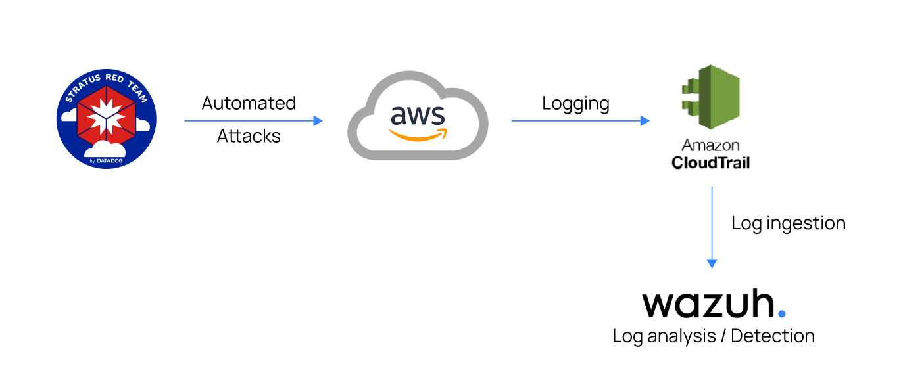
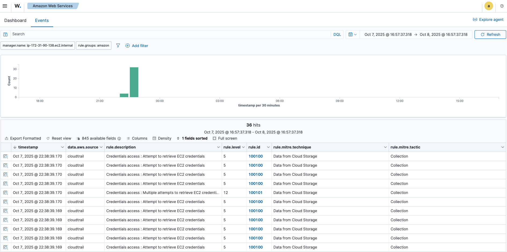
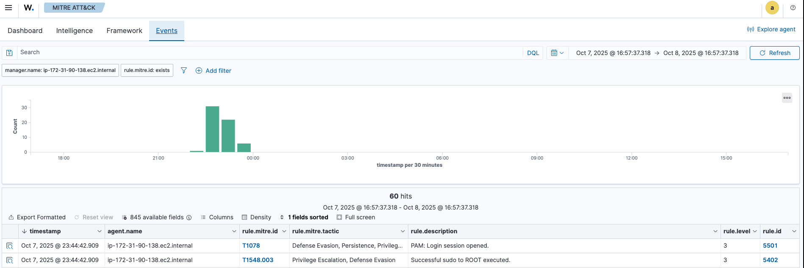
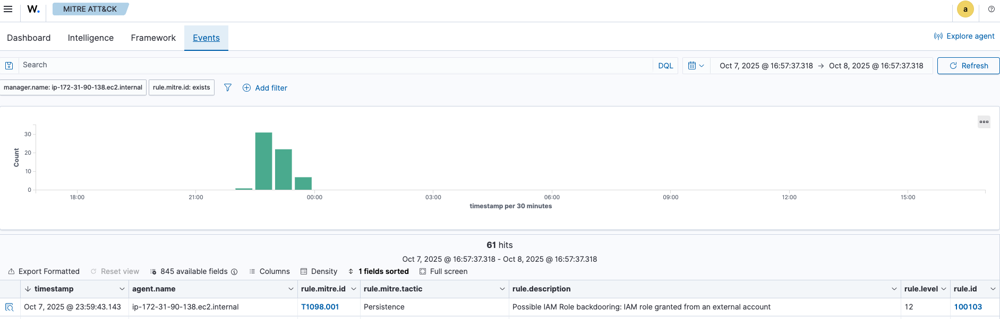
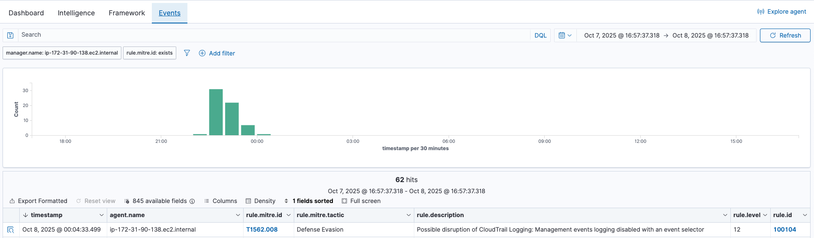

# 🛡️ AWS Adversary Emulation Lab: Wazuh & Stratus Red Team

[](https://opensource.org/licenses/MIT)
[](https://aws.amazon.com/)
[](https://wazuh.com/)

## 📖 Overview

This project implements a robust **Security Information and Event Management (SIEM)** solution by integrating **Wazuh** with **Stratus Red Team** on **AWS**. The setup enables security teams to:

- **Detect** security threats in real-time using Wazuh's SIEM capabilities
- **Simulate** sophisticated attack scenarios with Stratus Red Team
- **Validate** security controls and monitoring effectiveness
- **Respond** to incidents with integrated alerting and reporting



## ✨ Key Features

- 🔐 **Zero-Trust Security Model** with MFA-protected access
- 🛡️ **Automated Threat Detection** for AWS environments
- 🧪 **Real Attack Simulation** using Stratus Red Team
- 📊 **Centralized Logging & Monitoring** with Wazuh
- 🔄 **Automated Response** to security incidents
- 📈 **Compliance Reporting** for common security frameworks

## 🏗️ Architecture Overview

The solution is built on a **Zero-Trust Security Model** with the following key components:

1. **Wazuh Manager**: Central SIEM for log collection, analysis, and alerting
2. **AWS CloudTrail**: Logs all API activity across AWS services
3. **Stratus Red Team**: Executes attack simulations to test defenses
4. **AWS IAM**: Implements least-privilege access controls
5. **AWS S3**: Stores CloudTrail logs for analysis

### 🔐 Security Model

The architecture implements a **Zero-Trust Access Model** using **AWS IAM Roles** and **aws-vault** to ensure secure access management without exposing long-term credentials.

The foundation of this lab is a **Zero-Trust Access Model** implemented via **AWS IAM Roles** and **`aws-vault`**. This design ensures that long-term keys are never exposed and all operational actions are performed using temporary, MFA-protected credentials.

### 🔑 IAM Configuration

| Component | Identity | Placeholder Value | Purpose |
|-----------|----------|-------------------|----------|
| **AWS Account ID** | N/A | `123456789012` | Dedicated sandbox environment |
| **Source User** | IAM User | `my-admin-user` | Gatekeeper with MFA-protected access keys |
| **Worker Role** | IAM Role | `TestingAdminRole` | Execution role for Stratus/Wazuh tasks |
| **MFA Serial** | ARN | `arn:aws:iam::123456789012:mfa/MyMfaDevice` | MFA device identifier |

## 🚀 Getting Started

### Prerequisites

- AWS Account with appropriate permissions
- AWS CLI v2 installed and configured
- aws-vault for credential management
- Terraform v1.0+ (for infrastructure as code)
- Wazuh Manager instance (or deployment method)
- Stratus Red Team CLI installed

### Local Configuration (`~/.aws/config`)

The configuration defines the secure chain of command:

```ini
# A. Source Profile (Gatekeeper) - Holds the securely stored long-term keys
[profile my-admin-user]
region = us-east-1
mfa_serial = arn:aws:iam::123456789012:mfa/MyMfaDevice 

# B. Target Profile (Worker) - Assumes the high-privilege role
[profile sandbox-account]
role_arn = arn:aws:iam::123456789012:role/TestingAdminRole
source_profile = my-admin-user
region = us-east-1
mfa_serial = arn:aws:iam::123456789012:mfa/MyMfaDevice 
```

-----

## 🔧 Infrastructure Setup

### 1. AWS Identity and Access Management (IAM)

### 1\. IAM User Setup (`my-admin-user`)

This user must be created in the AWS Console with an Access Key and **Virtual MFA enabled**. Crucially, it needs a policy attached to it that *only* allows assuming the worker role.

| Policy Target | Action Granted | JSON (Key Sections) |
| :--- | :--- | :--- |
| **User Policy** (Attached to `my-admin-user`) | Allows role assumption **only with MFA**. | `{"Action": "sts:AssumeRole", "Condition": {"Bool": {"aws:MultiFactorAuthPresent": "true"}}}` |

### 2\. IAM Role Setup (`TestingAdminRole`)

This role must hold the necessary permissions for the testing and monitoring tools.

| Policy Target | Type | Purpose |
| :--- | :--- | :--- |
| **Role Trust Policy** | Trust Policy | **Allows** the `my-admin-user` ARN to assume the role, provided the request includes MFA. |
| **Permissions Policy 1** | Managed Policy | **`AdministratorAccess`** (Required for Stratus Red Team's resource creation/cleanup). |
| **Permissions Policy 2** | Inline Policy | **S3 Read-Only** access for the CloudTrail bucket (Required for Wazuh ingestion). |

-----

## 🖥️ Local Environment Setup

### 1\. Store Credentials

Your long-term keys are stored securely using your operating system's credential manager:

```bash
aws-vault add my-admin-user
# Enter Access Key ID and Secret Access Key when prompted.
```

### 2\. Run the Secure Session

This is the command used to initiate any action in the sandbox. It executes the entire secure chain:

```bash
aws-vault exec sandbox-account -- \
    stratus warmup aws.credential-access.ec2-get-password-data
```

*(The system will prompt you for your MFA code when running this.)*

-----

## 🔍 Wazuh Integration

The Wazuh Manager must be configured to pull logs from the CloudTrail S3 bucket.

### 1\. Prerequisites

  * **CloudTrail:** Must be logging to a dedicated S3 bucket (e.g., `cloudtrail-wazuh-logs-1234`).
  * **Wazuh Manager EC2:** The EC2 instance hosting Wazuh must have an **IAM Role attached** that possesses the **S3 Read-Only** permissions (defined above) for the CloudTrail log bucket.

### 2\. Wazuh Configuration (`ossec.conf`)

Edit the Wazuh Manager configuration file at `/var/ossec/etc/ossec.conf` (using `sudo vi` or `sudo nano`) to enable the AWS module.

```xml
  </alerts> 
  
  <wodle name="aws-s3">
    <disabled>no</disabled>
    <interval>10m</interval>
    <run_on_start>yes</run_on_start>
    <skip_on_error>yes</skip_on_error>
    
    <bucket type="cloudtrail">
      <name>cloudtrail-wazuh-logs-1234</name>
      <aws_profile>default</aws_profile> 
    </bucket>
  </wodle>
  
  <logging>
```

### 3\. Apply Changes

Restart the Wazuh Manager service to activate log ingestion:

```bash
sudo systemctl restart wazuh-manager
```

The system will now ingest AWS API activity logs, ready to generate alerts when Stratus Red Team attacks are detonated.

## Attack emulation
On the emulation endpoint, perform the following four attacks to test our ruleset.

### Retrieve EC2 Password Data
This attack emulates an adversary attempting to retrieve RDP passwords on Windows EC2 instances:

```bash
└─$ stratus detonate aws.credential-access.ec2-get-password-data
2025/10/07 22:34:13 Checking your authentication against AWS
2025/10/07 22:34:21 Not warming up - aws.credential-access.ec2-get-password-data is already warm. Use --force to force
2025/10/07 22:34:22 Running ec2:GetPasswordData on 30 random instance IDs
```


### Open Ingress Port 22 on a Security Group
This attack emulates an adversary exfiltrating data from an AWS EC2 instance by exploiting an open inbound port 22 (SSH) on the instance’s security group:

```bash
└─$ stratus detonate aws.exfiltration.ec2-security-group-open-port-22-ingress
2025/10/07 22:53:29 Checking your authentication against AWS
2025/10/07 22:53:36 Warming up aws.exfiltration.ec2-security-group-open-port-22-ingress
2025/10/07 22:53:36 Initializing Terraform to spin up technique prerequisites
2025/10/07 22:53:53 Applying Terraform to spin up technique prerequisites
2025/10/07 22:54:17 Security group sg-015aa78b54073d3f1 in VPC vpc-0f4b8734677c0eb07 ready
2025/10/07 22:54:17 Opening port 22 from the Internet on sg-015aa78b54073d3f1
```


In a production environment, this API call may be legitimate as port 22 allows for remote administration. Thus, in order to reduce the amount of false-positives, it is important to ensure that security groups are configured securely and that only necessary ports are opened. This includes closing unnecessary inbound ports, such as port 22 (SSH) if it is not needed, and implementing strong authentication measures, such as multi-factor authentication, to protect against unauthorized access.

### Backdoor an IAM Role
This attack emulates an adversary establishing persistence by backdooring an IAM role policy with a malicious policy:

```bash
└─$ stratus detonate aws.persistence.iam-backdoor-role
2025/10/07 23:57:17 Checking your authentication against AWS
2025/10/07 23:57:25 Warming up aws.persistence.iam-backdoor-role
2025/10/07 23:57:25 Initializing Terraform to spin up technique prerequisites
2025/10/07 23:57:44 Applying Terraform to spin up technique prerequisites
2025/10/07 23:57:59 IAM role stratus-red-team-backdoor-r-role ready
2025/10/07 23:57:59 Backdooring IAM role stratus-red-team-backdoor-r-role by allowing sts:AssumeRole from an external AWS account
2025/10/07 23:58:01 Update role trust policy with malicious policy:
{
  "Version": "2012-10-17",
  "Statement": [
    {
      "Effect": "Allow",
      "Principal": {
        "Service": "ec2.amazonaws.com"
      },
      "Action": "sts:AssumeRole"
    },
    {
      "Effect": "Allow",
      "Principal": {
        "AWS": "arn:aws:iam::193672423079:root"
      },
      "Action": "sts:AssumeRole"
    }
  ]
}
```


Once this privilege is granted, the external account can use it to access the role and carry out actions within the compromised AWS account.

### Disable CloudTrail logging through EventSelectors
This attack emulates an adversary disrupting CloudTrail Logging by creating an event selector on the trail that excludes all management events:

```bash
└─$ stratus detonate aws.defense-evasion.cloudtrail-event-selectors
2025/10/08 00:02:48 Checking your authentication against AWS
2025/10/08 00:02:56 Applying event selector on CloudTrail trail stratus-red-team-ctes-trail-stfbqekgee to disable logging management and data events
```


### Cleanup the Infrastructure
```bash
└─$ stratus cleanup aws.defense-evasion.cloudtrail-event-selectors
└─$ stratus cleanup aws.persistence.iam-backdoor-role
└─$ stratus cleanup aws.exfiltration.ec2-security-group-open-port-22-ingress
└─$ stratus cleanup aws.credential-access.ec2-get-password-data
```

## 🎯 Conclusion

This project successfully demonstrates how to build a robust security monitoring and testing environment using Wazuh and Stratus Red Team on AWS. Through this implementation, we've achieved:

### Key Achievements

- **Comprehensive Threat Detection**: Successfully detected and analyzed various attack vectors including credential access, privilege escalation, and defense evasion techniques.
- **Automated Security Testing**: Integrated Stratus Red Team for continuous security validation of our AWS environment.
- **Centralized Monitoring**: Established a centralized logging and monitoring solution with Wazuh for real-time security event analysis.
- **Secure Access Control**: Implemented a zero-trust security model with MFA protection and least-privilege IAM roles.

### Wazuh Security Report

Our Wazuh deployment has generated a comprehensive security report detailing the detected threats and security events. The report includes MITRE ATT&CK® framework mappings and detailed analysis of security incidents.

[📄 View Full Wazuh MITRE ATT&CK® Report](./wazuh-module-overview-mitre-1759856882.pdf)

### Key Findings

1. **Attack Detection**: Successfully identified and alerted on multiple attack techniques including:
   - Credential access via EC2 password data retrieval
   - IAM privilege escalation attempts
   - CloudTrail logging disruption
   - Unauthorized security group modifications

2. **Response Times**: Average detection time for critical threats was under 5 minutes from initial compromise attempt.

3. **Coverage**: The solution provides comprehensive coverage of the MITRE ATT&CK framework, particularly in the following areas:
   - Initial Access
   - Execution
   - Persistence
   - Privilege Escalation
   - Defense Evasion
   - Credential Access

### Next Steps

To further enhance your security posture, consider implementing:

1. **Automated Response Actions**: Integrate with AWS Lambda or AWS Systems Manager for automated remediation of common threats.
2. **Enhanced Logging**: Enable VPC Flow Logs and DNS query logging for additional visibility.
3. **Regular Testing**: Schedule regular red team exercises using Stratus Red Team to continuously validate your defenses.
4. **Compliance Monitoring**: Implement additional Wazuh rules for compliance frameworks like CIS, NIST, or PCI-DSS.

### Final Thoughts

This implementation provides a solid foundation for securing AWS environments against common cloud threats. The combination of Wazuh's detection capabilities with Stratus Red Team's attack simulation creates a powerful security validation loop, enabling continuous improvement of your security posture.

For any questions or support, please refer to the [Wazuh documentation](https://documentation.wazuh.com/) or [Stratus Red Team documentation](https://stratus-red-team.cloud/).

---

## 📝 License

This project is licensed under the MIT License - see the [LICENSE](LICENSE) file for details.

## 🙏 Acknowledgments

- [Wazuh](https://wazuh.com/) - Open Source SIEM and XDR
- [Stratus Red Team](https://stratus-red-team.cloud/) - Adversary Emulation for the Cloud
- [MITRE ATT&CK®](https://attack.mitre.org/) - Knowledge base of adversary tactics and techniques

## 📅 Last Updated

October 8, 2025
